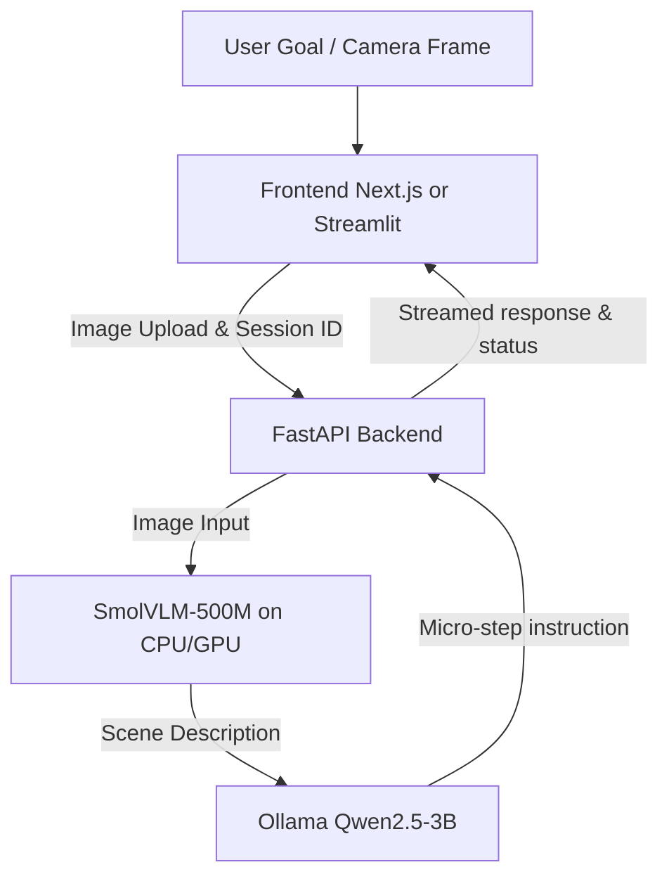

# 🧠 ADHD Smart Companion

An interactive, supportive real-world task companion designed to help users with ADHD focus and complete tasks step by step. By combining a local Vision-Language Model (VLM) for scene understanding and a Large Language Model (LLM) for action guidance, the assistant breaks down complex goals into bite-sized, single-sentence micro-steps.

---

## 🏗️ System Architecture

The application is structured into two main components: a python-based backend orchestrating the ML logic, and two user-facing frontend options.



### 1. Backend (FastAPI)
- **API Server** (`main.py`): Hosts REST and Streaming endpoints to manage focus sessions.
- **Vision-Language Model** (`vlm.py`): Loads `HuggingFaceTB/SmolVLM-500M-Instruct` locally to describe objects and surfaces in 1-2 sentences.
- **Task Planning LLM** (`llm.py`): Integrates with a local **Ollama** server running `qwen2.5:3b` to issue simple, context-aware instructions (max 6 words).
- **Session Management** (`session.py`): Holds history, strips output flags (like `DONE`), controls step execution safety limits, and manages user feedback/rephrasing logic.

### 2. Frontend Interfaces
- **Next.js Web App** (`app/`, `components/`): A premium React frontend implementing:
  - **Gamification engine**: XP tracking, day streaks, and visual reward popups.
  - **Voice guidance**: Automated speech synthesis (TTS) reading steps aloud.
  - **Custom Camera feed**: Streamlined capture utility.
- **Streamlit Interface** (`frontend.py`): A lightweight, Python-native dashboard supporting camera upload, step history, and session state tracking.

---

## 🛠️ Prerequisites & Installation

### 1. Install & Run Ollama
1. Download and install [Ollama](https://ollama.com).
2. Pull the required language model:
   ```bash
   ollama pull qwen2.5:3b
   ```
3. Make sure the Ollama application is running in the background.

### 2. Set Up Python Environment
Install backend dependencies using `pip`:
```bash
pip install -r requirements.txt
```
*(Dependencies include: `transformers`, `torch`, `accelerate`, `fastapi`, `uvicorn`, `streamlit`, `pillow`, `python-multipart`, `requests`)*

---

## 🚀 Running the Project

### 1. Start the API Backend
From the workspace root, run the FastAPI application:
```bash
python main.py
```
The server will boot and listen at `http://localhost:8000`.

### 2. Start the Frontend
You can interact with the companion through either of these frontends:

#### Option A: Streamlit (Python)
To launch the simple Python web dashboard:
```bash
python -m streamlit run frontend.py
```
Open [http://localhost:8501](http://localhost:8501) in your browser.

#### Option B: Next.js (React)
*(Requires Node.js and npm installed)*
To build and launch the fully gamified web application:
```bash
npm install
npm run dev
```
Open [http://localhost:3000](http://localhost:3000) in your browser.

---

## 🔌 API Documentation

| Endpoint | Method | Payload / Form Data | Response | Description |
|---|---|---|---|---|
| `/health` | GET | None | `{"status": "ok", "active_sessions": int}` | Backend health check. |
| `/session/new` | POST | `{"goal": "str"}` | `{"session_id": "str", "goal": "str"}` | Starts a new task companion session. |
| `/session/{id}/step` | POST | `image: File` | `StepResponse` | Uploads environment image, runs VLM+LLM, and returns the next micro-step. |
| `/session/{id}/step-stream` | POST | `image: File` | `Streamed Text` | Standard streamed character typing response for step instructions. |
| `/session/{id}/feedback` | POST | `{"completed": bool}` | `FeedbackResponse` | Confirms if step was completed or requests rephrase. |
| `/session/{id}/status` | GET | None | `SessionStatus` | Returns current iteration, goal, and completed steps. |
| `/session/{id}` | DELETE | None | `{"ok": bool}` | Force ends and deletes the session. |
